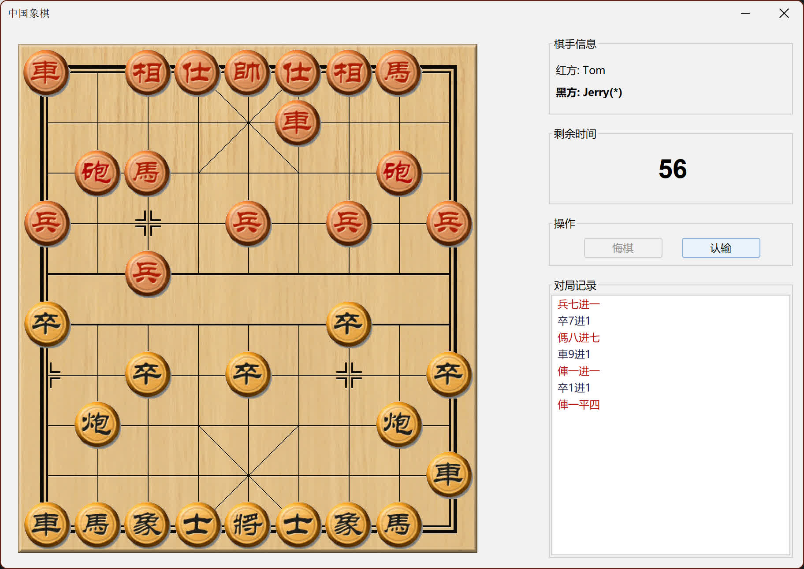
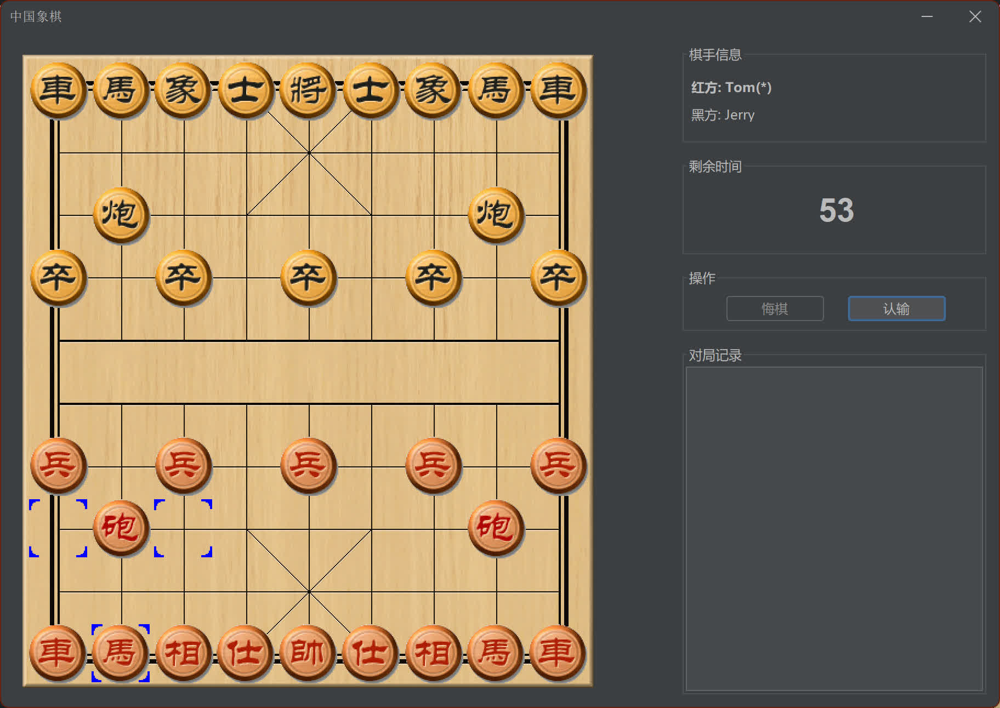
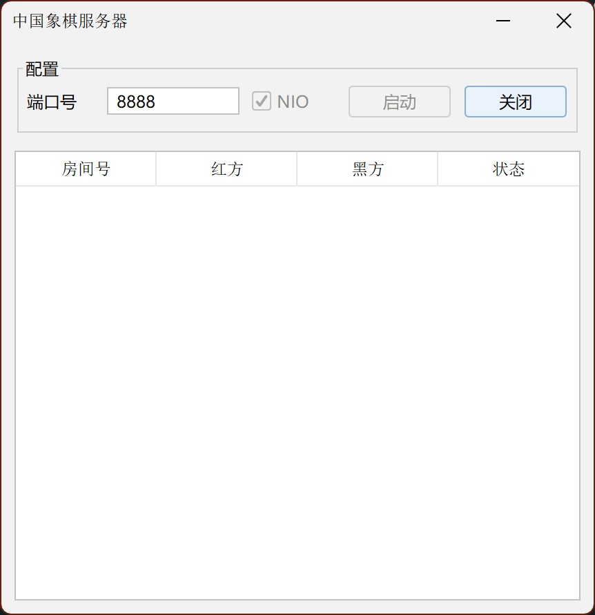
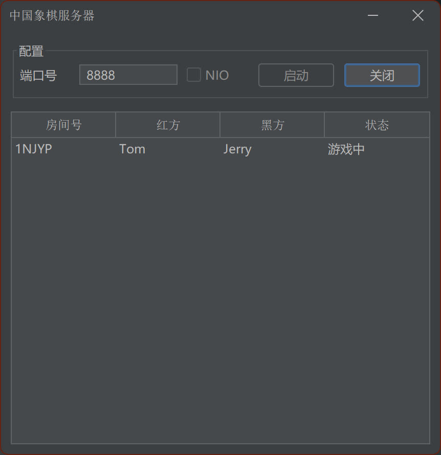

# 中国象棋

## 效果截图

<table>
    <tr>
        <td></td>
        <td></td>
    </tr>
    <tr>
        <td></td>
        <td></td>
    </tr>
</table>

## 协议

### 创建房间

```
Client -> CreateRoomRequest (null)
Server -> CreateRoomResponse(result, message, roomID)
    失败: result = ERROR, message = "<出错原因>"
    成功: result = SUCCESS, message = "", roomID = <有效的roomID>
```

### 加入房间

```
Client -> JoinRoomRequest(userName, roomID)
Server -> JoinRoomResponse(result, message, roomID)
    失败: result = ERROR, message = "<出错原因>"
    成功: result = SUCCESS, message = ""
```

### 开始游戏

```
Server -> StartGameResponse(redPlayerName, blackPlayerName)
    redPlayerName: 红方的玩家名
    blackPlayerName: 黑方的玩家名
```

### 移动棋子

```
Client -> MovePieceRequest(roomID, userName, from, to)
    roomID: 房间号
    userName: 玩家名
    from: 棋子的起始位置
    to: 棋子的目标位置
注: 服务器对请求的合法性进行检查(如:该位置是否允许移动\是否轮到该玩家等)

Server: 
向移动棋子的玩家发送:
    MovePieceResponse(result, message)
    若移动成功: result=SUCCESS
    若移动失败: result=ERROR, message="<出错原因>"

若移动成功:
向另一玩家发送:
    MovePieceResponse(result, message, from, to)
    若移动成功: result=SUCCESS, from=棋子的起始位置, to=棋子的目标位置
```

### 游戏结束

```
Server:
向所有玩家发送 GameOverResponse(winner), 断开 Socket 连接
```

## 许可
[MIT License](https://github.com/jlzhjp/chinese-chess/blob/main/LICENSE)

图片资源来自网络

feel free to use :)
